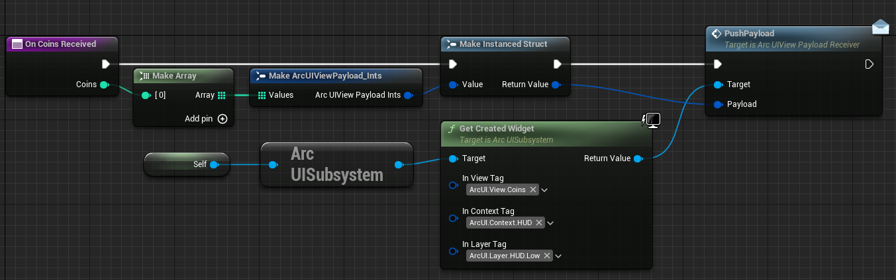

# ArcUI / Arcstone UI  plugin
>  UI Framework for UE5 & UMG: Widget Contexts, Model&middot;View&middot;Presenter and more...!

This plugin contains 3 modules:
* **ArcUIFramework** is a Context-based UI management system. It also provides an optional Model/View/Presenter architecture to separate logic and display.
* **ArcUIFrameworkEditor** provides a few editor customizations for the previous module
* **ArcUICommon** contains a few helpers: improved buttons and other widgets...

> [!NOTE]  
> This plugin relies on a few Epic plugins including CommonUI  
> Some parts of this plugin are largely inspired by Epic's Lyra project

## Arc UI Framework

### Concepts

Core concepts:
* **Contexts** - based upon GameplayTags, contexts drive what is displayed or not. For instance, you can request "ArcUI.Context.HUD" to display your whole HUD, or just request "ArcUI.Context.HUD.HealthBar" to only display the health bar from the HUD.
* **Layout/Layers** - heavily inspired (but simplified) from Lyra, the layout and its layers define the high level positioning (stacking) of your widgets.

Additional concepts (MVP approach): 
* **Views** - UMG classes to be displayed on screen. It is suggested to define these classes in c++ and override them in Blueprint. Depending on their usage, they will be either:
  * a `UUserWidget` or `UCommonUserWidget` for a classic widget
  * a `UCommonActivatableWidget` for a "main" screen like the whole HUD, a menu...
* **ViewPayloads** - contracts between a *Presenter* and a *View*. They are usually the data being sent by a *Presenter* to its View(s). Note that this plugin does not enforce anything regarding the payloads. They are provided as a convenience, but it is up to the project to set them up as they wish/prefer, or use MVVM instead.
* **Presenters** - the real brains of your UI. They will listen to the game logic (Model), make *ViewPayloads* out of it and send them to their associated *Views*.


### Getting Started

#### Installing

Clone this repository or copy the files to your Game/Plugins folder.  
Then add it to your uproject, in your declared plugins:
```json
{
    "Name": "ArcUI",
    "Enabled": true
}
```
Then in your .Build.cs, add the module:
```csharp
PrivateDependencyModuleNames.Add("ArcUIFramework");
```
And that's it! You're ready to use the `ArcUIFramework`!

#### Defining a Layout

The layout is the core of our UI structure, so we need to set it up first.  
`ArcUIFramework` already comes with a workable Layout than you can use. So go into your Project Settings, down to Arcstone / ArcUI Settings, and pick the provided `W_ArcLayout`.  
  
This Layout uses 4 layers to organize and display different things. Each layer is identified by a GameplayTag: 
* `ArcUI.Layer.HUD.Low` - classic HUD info: health bars...
* `ArcUI.Layer.HUD.High` - in-gameplay menus: inventory, trading...
* `ArcUI.Layer.Menu` - classic menus: settings...
* `ArcUI.Layer.Modal` - modal popups: errors...

*To Be Documented (advanced): creating your custom Layout*

#### Creating your Views

Before we start creating widgets for our HUD, we have a few steps to take care.

1. Defining a Context

A **Context** is no more than a Gameplay Tag, which we can define either within the editor or in c++ as a `NativeGameplayTag`. Native GameplayTags have the advantage of being naturally usable in code, so this may be the preferred way. To add a **Context** as a native tag, add this into a header:
```c++
namespace ArcUIDemoTags::UI
{
	namespace Context
	{
		UE_DECLARE_GAMEPLAY_TAG_EXTERN(HUD);
	}
}
```
and in the cpp:
```c++
namespace ArcUIDemoTags::UI
{
	namespace Context
	{
		UE_DEFINE_GAMEPLAY_TAG_COMMENT(HUD, "ArcUI.Context.HUD", "ArcUI Demo - HUD Context")	
	}	
}
```
And that's it for our first context!

2. Using the Context

The ArcUI Subsystem can handle multiple Contexts at once. When you add one, a few things happen:
* The ArcUI Loader is notified so that it can load Presenters & Views on demand
* Some Views may be automatically added on the right Layout/Layer
* Finally, relevant Presenters are notified of the Context being added, and they can apply their logic

Adding a Context from code is straightforward:
```c++
void AArcUIDemoGameMode::BeginPlay()
{
	Super::BeginPlay();

	GetGameInstance()->GetSubsystem<UArcUISubsystem>()->AddContext(ArcUIDemoTags::UI::Context::HUD);
}
```
Or from Blueprint:


*To Be Documented (advanced): Context Payloads*

3. Defining a view

Similarly, a *View* is identified by a GameplayTag. Again, you have the option to define it as a Native GameplayTag or not.
```c++
namespace ArcUIDemoTags::UI
{
	namespace View
	{
		UE_DECLARE_GAMEPLAY_TAG_EXTERN(HUD);
	}
}
```
```c++
namespace ArcUIDemoTags::UI
{
	namespace View
	{	
		UE_DEFINE_GAMEPLAY_TAG_COMMENT(HUD, "ArcUI.View.HUD", "ArcUI Demo - HUD View");
	}
}
```

Now that we have a unique identifier for the View, let's create the widget. You can define a base class in c++ or directly in BP depending on your needs. Regardless, any top layer should be a child of `UCommonActivatableWidget`. 
So if you declare it in c++, it could be something like this:
```c++
UCLASS(Abstract, NotBlueprintable, meta=(DisableNativeTick))
class UArcUIDemoHUDWidget : public UCommonActivatableWidget
{
	GENERATED_BODY()
};
```
Then in the editor, just create a new widget Blueprint (W_HUD) based off the right parent class:  
  
We'll leave it empty for now and get back to it later.  
Now let's register it. Go to the `Project Settings > Arcstone > ArcUI Settings`, and register on new Widget:  
  
A few explanations on what we did there. The first few settings should be pretty clear:
* View Tag: we are using the unique Tag we created earlier
* Widget Class: we are picking the previously created HUD widget
* Keep Always Loaded: this is not something we want for the HUD, as we wouldn't it to be loaded during the Main Menu for instance. Consider using this flag only while debugging.  

Now for the most advanced settings... We created a "Context Action" which is basically "*What should happen when this Context is added*". For now, only 2 things can happen: loading the widget (as it was referenced as a soft class and thus never loaded), and creating the widget automatically somewhere:
* Context Tag:  the context we want the action to be tied to, obviously the HUD Context we created in this case.
* Loading Tied to Context: if the widget should be loading right before applying the Context. We use this in our case to simplify the process.
* Creation Tied to Context: if the widget should be pushed on screen before applying the Context (so that Presenters can use it). We use this in our case to simplify the process further.
* Created on Layer Tag: if we need to create the widget, on which layer should it belong. We are using the `HUD.Low` layer in this case.
* Slot Name: which slot should this new widget be assigned to. This is not relevant in our case, but we'll use this setting later.

And just with that, we have our HUD automatically loaded and pushed on the screen once the ArcUI.Context.HUD is added! Now we can get into creating some widgets for our HUD.

#### Creating our first View in c++

For this first View, we'll define it in code as an example. We'll make another View purely in BP later.  
So for this example, we'll want to display the number of jumps the character makes. We consider that it will be only visible once we do a first jump, which means that the Context will only be added at this time.

##### Context
As previously, we'll add a new `JumpCounter` Context, child of the HUD Context. And while we're there, we had the new View tag.
```c++
// in a .h
namespace Context::HUD
{
	UE_DECLARE_GAMEPLAY_TAG_EXTERN(JumpCounter);
}
namespace View
{
	UE_DECLARE_GAMEPLAY_TAG_EXTERN(JumpCounter);
}

// in a .cpp
namespace Context::HUD
{
	UE_DEFINE_GAMEPLAY_TAG_COMMENT(JumpCounter, "ArcUI.Context.HUD.JumpCounter", "ArcUI Demo - JumpCounter Context")
}
namespace View
{
	UE_DEFINE_GAMEPLAY_TAG_COMMENT(JumpCounter, "ArcUI.View.JumpCounter", "ArcUI Demo - JumpCounter View");
}
```
Next we create a base class for our widget. It should be a `UserWidget` child class.
```c++
UCLASS(Abstract, Blueprintable, meta=(DisableNativeTick))
class UArcUIDemoJumpCounterWidget final : public UUserWidget
{
	GENERATED_BODY()
};
```
Then we create the BP widget:  
  
We'll keep it very simple for now:  
  
Now we'll want this widget to be automatically added to the HUD when `HUD.JumpCounter` is added, so we'll add a Named Slot into the HUD:  
  
Now we have everything to set up our view!  
  
Note that we add 2 actions:
* A first one to load the Widget as soon as we add the `HUD` (parent) Context
* A second one to create the Widget once we add the `HUD.JumpCounter` Context  
Now if you launch the game, you wouldn't see the new widget on scree, which is normal because nothing is pushing the Context! So let's just do that!
The `ACharacter` class provides a `OnJumped` *BlueprintNativeEvent* which we can override. We also add a boolean to make sure we don't push the Context more than once:  
```c++
void AArcUIDemoCharacter::OnJumped_Implementation()
{
	Super::OnJumped_Implementation();

	if (!bHasJumped)
	{
		GetGameInstance()->GetSubsystem<UArcUISubsystem>()->AddContext(ArcUIDemoTags::UI::Context::HUD::JumpCounter);
		bHasJumped = true;
	}		
}
```
And now the widget will appear once we hit the Jump button! But obviously it still doesn't increment the count. We need to implement the last crucial part of the system: a **Presenter**.  
So we create a new Presenter class, inheriting from `UArcUIPresenter`:
```c++
UCLASS(NotBlueprintable)
class UArcUIDemoJumpCounterPresenter final : public UArcUIPresenter
{
	GENERATED_BODY()
};
```
Before getting into its implementation, we need to solve something: its ownership. Presenters are UObjects, they need to be managed by Actors or other UObjects (in a GC path). In our case, the character seems to be fitting as a great owner, since that's where we handle the jumps already, so let's add our Presenter there:
```c++
// in the header
UPROPERTY(Transient)
TObjectPtr<UArcUIDemoJumpCounterPresenter> JumpCounterPresenter{nullptr};

// in AArcUIDemoCharacter::BeginPlay()
if (!JumpCounterPresenter)
{
    JumpCounterPresenter = NewObject<UArcUIDemoJumpCounterPresenter>(this);
}
// Here we tell the Presenter on which tag(s) it should react to
JumpCounterPresenter->SetContextTag(ArcUIDemoTags::UI::Context::HUD::JumpCounter);
// This is an optional feature: an "Observed" actor will be available whenever the Context is added. In this case, we watch the player character.
JumpCounterPresenter->SetObservedActor(this);
// We finally register the Presenter to the subsystem so that it can react when needed
GetGameInstance()->GetSubsystem<UArcUISubsystem>()->RegisterPresenter(JumpCounterPresenter);
```
Now let's get back to the Presenter implementation.  4 functions can be overridden:
```c++
virtual bool HandleOnContextAdded(FGameplayTag ContextTag, const TInstancedStruct<FArcUIContextPayload>& Payload) override;
virtual bool HandleOnContextRemoved(FGameplayTag ContextTag) override;
virtual bool HandleShowContext(FGameplayTag ContextTag) override;
virtual bool HandleHideContext(FGameplayTag ContextTag) override;
```
The last 3 are to help with cleanup or with contextual actions, but the first one (OnContextAdded) is the most important because this is where we do all the "heavy" setup.
In our case we'll register to a new character event, using the "Observed Actor" feature:
```c++
bool UArcUIDemoJumpCounterPresenter::HandleOnContextAdded(FGameplayTag ContextTag, const TInstancedStruct<FArcUIContextPayload>& Payload)
{
	bool bHandled = Super::HandleOnContextAdded(ContextTag, Payload);
	if (ContextTag == ArcUIDemoTags::UI::Context::HUD::JumpCounter)
	{
		JumpCounter = 0; // member variable of UArcUIDemoJumpCounterPresenter
		if (auto* DemoCharacter = Cast<AArcUIDemoCharacter>(ObservedActor))
		{
			OnJumpedHandle = DemoCharacter->OnDemoJumped.AddUObject(this, &ThisClass::OnCharacterJumped);
			bHandled = true;
		}		
	}
	return bHandled;
}
```
and then:
```c++
void UArcUIDemoJumpCounterPresenter::OnCharacterJumped()
{
	using namespace ArcUITags;
	using namespace ArcUIDemoTags::UI;
	
	JumpCounter++;
	if (auto* JumpCounterWidget = UISubsystem->GetCreatedWidget(View::JumpCounter, Context::HUD::JumpCounter, Layer::HUD::Low))
	{
		// ???
	}
}
```
Now we are at the last step of our data flow: passing the information from the Presenter to the View. There are multiple ways of doing so, but we'll just showcase the custom one that is provided in this framework: the ViewPayloads.
```c++
USTRUCT(BlueprintType)
struct FArcUIDemoJumpViewPayload final : public FArcUIViewPayload
{
	GENERATED_BODY()
	
	FArcUIDemoJumpViewPayload() = default;
	explicit FArcUIDemoJumpViewPayload(int32 InCounter) : Counter(InCounter) {}
	
	UPROPERTY(EditAnywhere, BlueprintReadOnly)
	int32 Counter{0};
};
```
This structure is only meant to be passed from a Presenter to a View, but Views must implement `IArcUIViewPayloadReceiver` to receive them:
```c++
class UArcUIDemoJumpCounterWidget final : public UUserWidget, public IArcUIViewPayloadReceiver
```
Now we can get back to our Presenter and pass the ViewPayload:
```c++
void UArcUIDemoJumpCounterPresenter::OnCharacterJumped()
{
	using namespace ArcUITags;
	using namespace ArcUIDemoTags::UI;
	
	JumpCounter++;
	if (auto* JumpCounterWidget = UISubsystem->GetCreatedWidget<UArcUIDemoJumpCounterWidget>(View::JumpCounter, Context::HUD::JumpCounter, Layer::HUD::Low))
	{
		const auto Payload = ArcUI::MakeViewPayload<FArcUIDemoJumpViewPayload>(JumpCounter);
		JumpCounterWidget->PushPayload(Payload);
	}
}
```
And now we're free to implement the function in the Widget BP:  
  
And that's it! Now, everytime you jump, the counter will be updated!

Now let's do (almost) the same thing but only in BP! Since we went through the concepts already, it should be much faster!  
For this one we'll add something directly on the HUD, using the `HUD` Context directly.  
So we create our "Coins" Widget:  
  
We make it implement the `ArcUIViewPayloadReceiver` interface:  
  
We register the View:  
  
We create a BP Presenter:  
  
And we implement its `OnContextAdded`:
  
  
> [!TIP]  
> Here we use an already-defined and generic ViewPayload (ArcUIViewPayload_Ints). Feel free to use them for prototyping!
> However, if you need a more custom one, for now you would have to create it in c++.   

For BP Presenters, we can use a simplified ownership through the ArcUI Settings:  
  
And the last part is the Widget implementation:  
  
And that's it! Our coins are now displayed when we pick them up!

### Mock testing

*To Be Documented (advanced): mock testing your setup*

### V2 TODO

* Optional AsyncLoad for Widgets
* More creation options (within panels for instance)


## Arc UI Common

### Installing

Clone this repository / copy the files to your Game/Plugins folder.  
Then add it to your uproject, in your declared plugins:
```json
{
    "Name": "ArcUI",
    "Enabled": true
}
```
Then in your .Build.cs, add the module:
```csharp
PrivateDependencyModuleNames.Add("ArcUICommon");
```
And that's it! You're ready to use the module!

## Licensing

Licensed under MIT.
